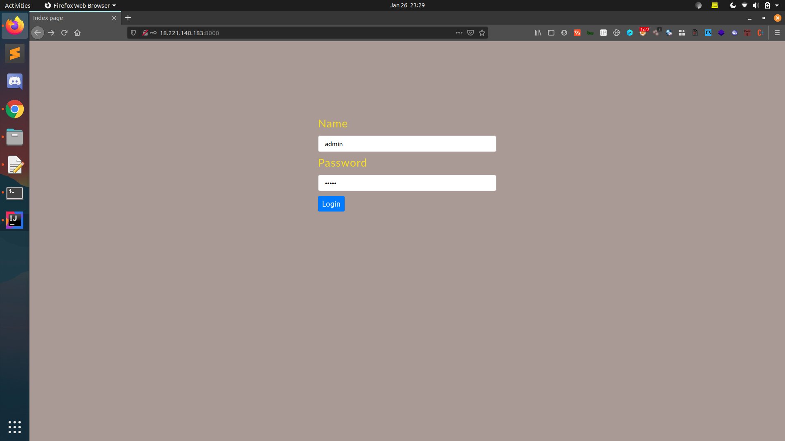
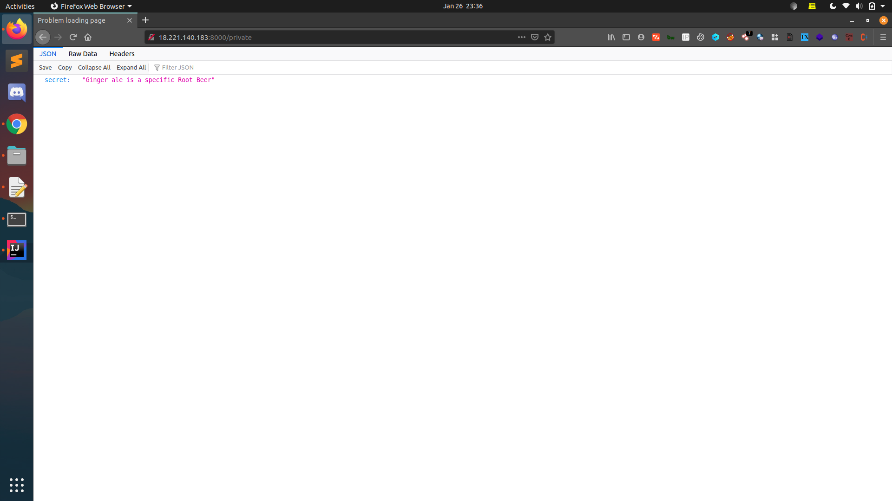
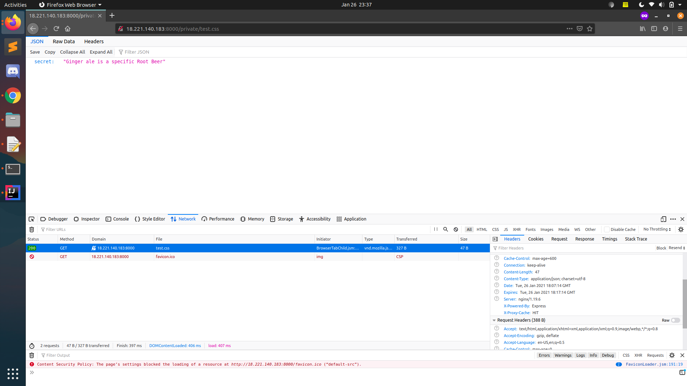

# Replication of web_cache_deception
- Login using username- admin and password -admin

- /private is vulnerable path.This path can only be accessed after correct authentication.

- static path added to /private gets catched by the server like /private/test.css

- /private/test.css can then be accessed without authentication.

